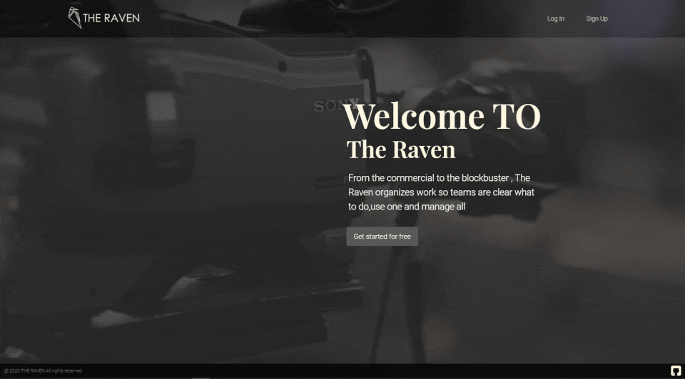
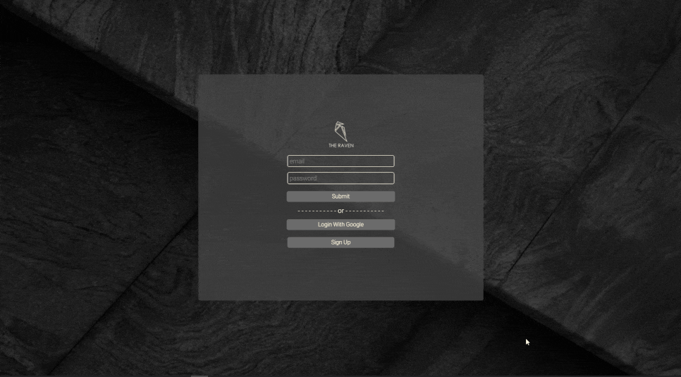
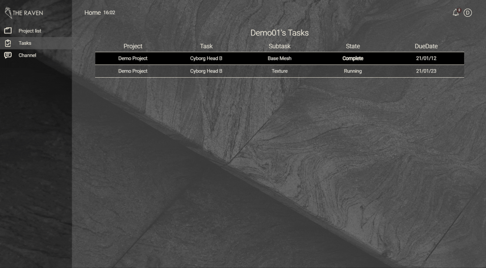
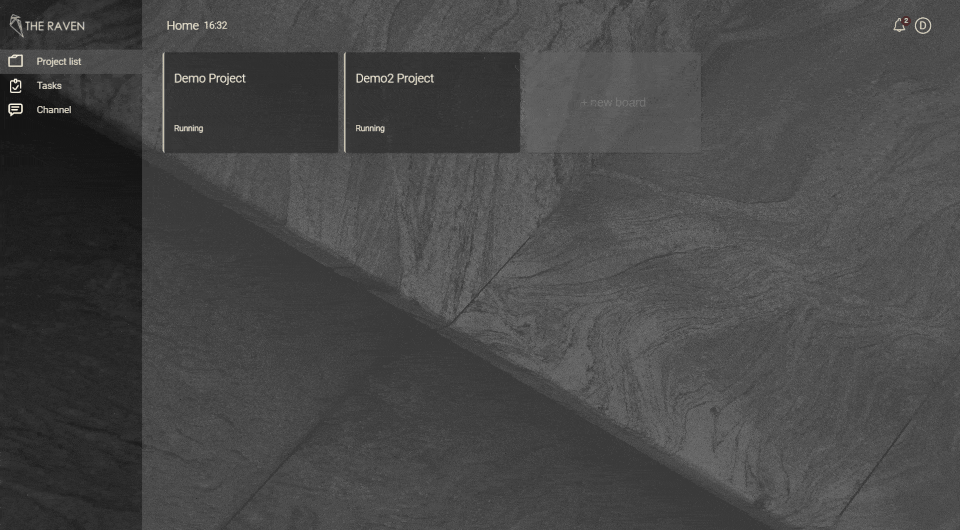
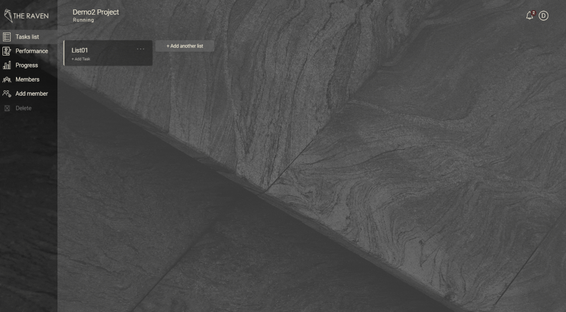

# THE RAVEN

A production project management system.
From small project to blockbuster,THE RAVEN let user can easily manage projects
every where and when.

## Demo Account

Link : https://the-raven-a298b.web.app/  
ID: demouser@gmail.com Password: demouser

### Technologies

**Front-End Skills**

- HTML
- CSS
- JS (ES6)
- Flex/Grid
- RWD

**Front-End Frameworks**

- React (Hooks)
  - React Router
  - Redux
  - Redux-Thunk

**Libraries/API**

- react-beautiful-dnd
- react-nice-date
- react-chartjs-2

**Cloud Service**

- Firebase
  - Firebase Authentication
  - Firebase Storage
  - Firestore
  - Hoisting

**Lint Tools**

- ESLint
- Prettier

**2D Tools**

- Adobe XD
- Adobe Illustartor
- Adobe Premiere

### User Flow

### Plateform function demo

#### Native sign up

#### 3rd party or native log in

#### Create project

#### Assigned tasks tracking

#### Project channel

#### TaskList create

#### Task content create

#### File & Reference attachment

#### Task content remove & update

#### Rearrange tasks and subtasks order

#### Subtask comment & notification

#### Project and project members status monitoring

## Plan for Next Version

- Project Gantt
- Improve Project channel markdown input
- Chat zoom

## Contact

Email: ericfei0521@gmail.com
